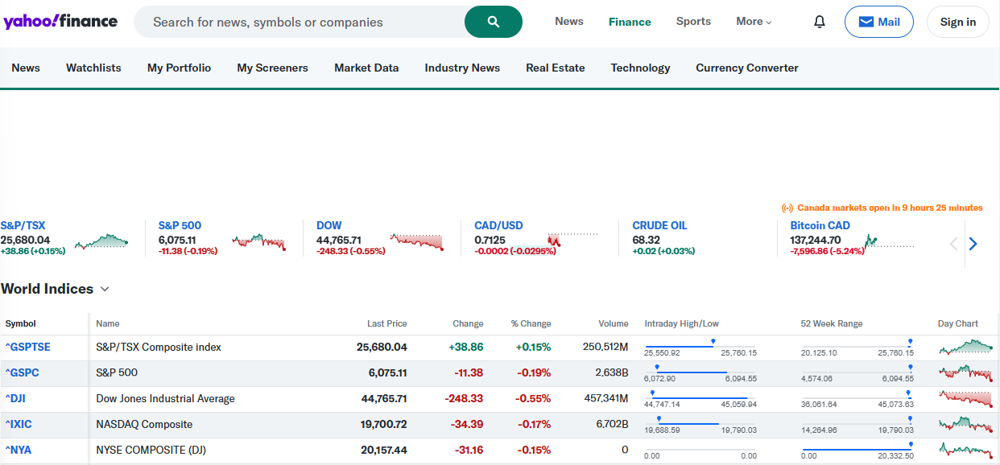
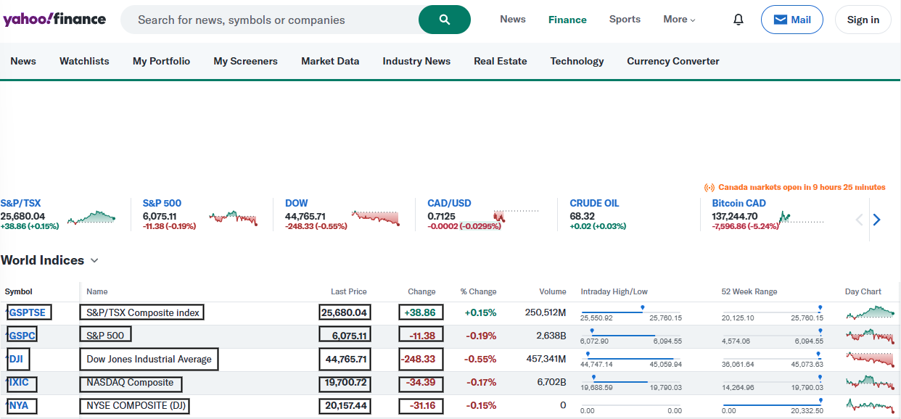
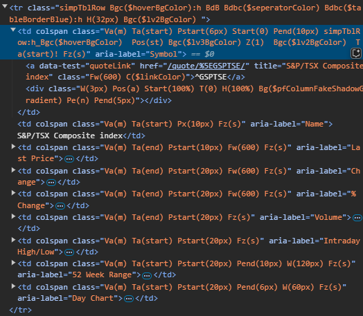

<br />

# Lazy Data Collection: An Intro to Python Web Scraping

December 7th, 2024
By: Ryan Chung
For LazyHacks 2024

---

<!-- class: inverted -->
<br />

### ✦ About Me


- 3rd Year Carleton University Computer Science Student
- Bachelor of Computer Science Student
- Interested in large-scale systems

---

<br />

### ✦ Prerequisites for this presentation

- Python3
  - [python.org/downloads](https://www.python.org/downloads/)
- Selenium
  - Once Python is installed:
  - `pip install selenium`

<br/>


---

<!-- class: invert -->
<br />

### ✦ What is Web Scraping?

- **Automated** process of extracting data from websites
- Extract information that you cannot find in plain data
  - Web page, not accessible through an API
- To collect information, you can either:
  - Hard Way: Manually collect information
  - **Lazy Way:** Automate using a script!
    - Do once, never again

---

<!-- class: inverted -->
<br />

### ✦ Website to scrape

Link: <https://ca.finance.yahoo.com/world-indices/>

<br/>



---

<br />

### ✦ Visually looking for information

Link: <https://ca.finance.yahoo.com/world-indices/>

<br/>



---

<!-- class: invert -->
<br />

### ✦ How would we automate this?

- Inspect the HTML for the structure (CTRL + Shift + I)



---

<!-- class: inverted -->
<br />

### ✦ Selenium


- Automation tool used for web scraping in Python, using a **web browser to render websites**.
- Page navigation and locating elements **like a real user**
- Some other options are tools such as BeautifulSoup do static scraping (only HTML)

---

<br />

### ✦ Project Setup

Let's set up our a project to start this workshop!

1. Create a folder called `demo/`
2. Create a `main.py` file within the folder
3. Add the following code to the `main.py` file:

```python
print("Hello, World!")
```

4. Run the file (within the directory): `python main.py`

---

<br />

### ✦ Imports

Let's start coding!

```python
from selenium import webdriver
from selenium.webdriver.common.by import By
from selenium.webdriver.support.ui import WebDriverWait
from selenium.webdriver.support import expected_conditions as EC
import csv
```

Full code can be found in the following repository:
<https://github.com/ryangchung/lazyhacks-2024-web-scraping-workshop>

---

<br />

### ✦ Boilerplate Code

```python
# Initialize WebDriver (so that it can run in a browser)
with webdriver.Chrome() as driver:
    # Open the Yahoo Finance World Indices page
    driver.get("https://ca.finance.yahoo.com/world-indices")

    # Wait for the table to render (ensuring that the table is loaded)
    table = WebDriverWait(driver, 10).until(
        EC.presence_of_element_located((By.CSS_SELECTOR, "table"))
    )

    # Get each row in the table
    rows = table.find_elements(By.CSS_SELECTOR, "tbody > tr")
```

---

<br />

### ✦ Extracting Data

```python
with webdriver.Chrome() as driver:
    ...
    # Extract data from each row, filtering out only the relevant columns
    data = []
    for row in rows:
        cells = row.find_elements(By.TAG_NAME, "td")
        row_data = []
        for cell in cells:
            aria_label = cell.get_attribute("aria-label")
            if aria_label in ["Symbol", "Name", "Last Price", "Change"]:
                row_data.append(cell.text)
        if row_data:
            data.append(row_data)
```

---

<br />

### ✦ Saving to a file

```python
    ...
    # Save the scraped data to a CSV file
    with open('scraped_data.csv', 'w', newline='') as file:
        writer = csv.writer(file)
        writer.writerow(["Symbol", "Name", "Last Price", "Change"])
        writer.writerows(data)
```

---

<br />

### ✦ Run the Code

- In your terminal, run:

```bash
python main.py
```

- After it is done running, you can find a file called `scraped_data.csv` in the same folder
- Your data is located there to be used!

---

<br />

### ✦ Implications of Web Scraping

- **Ethics:** Websites may have checks and blocks for web scraping, as it costs them resources
  - Web scrape respectfully
- **Fault tolerance:** If the website changes its code, for example aria-labels and HTML structure, the script might need to be changed to account for this
  - Finding the correct selectors is a skill!

---

<!-- class: invert -->
<br />

### ✦ Thanks for listening

Any questions?
<br />
<br />
**Feel free to reach out during the event if you would like to talk about anything, including choosing a university major, career, or growing in tech!**
